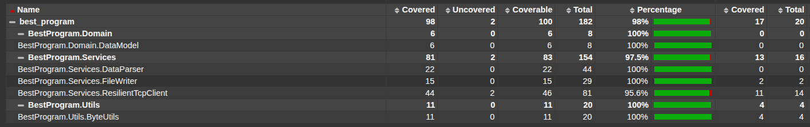

# Сетевой сборщик данных (BestProgram)

Консольное приложение на C# (.NET) для непрерывного получения данных по сети.

Программа подключается к одному серверу по двум разным портам, считывает бинарные данные, проверяет их целостность и записывает в общий файл. Реализован механизм автоматического переподключения при разрывах связи или ошибках валидации.

## Описание задачи

Необходимо получать данные с сервера **95.163.237.76** по двум каналам:

1.  **Порт 5123:** Данные о погоде (Timestamp, Temp, Pressure).
2.  **Порт 5124:** Векторные данные (Timestamp, X, Y, Z).

**Особенности протокола:**
*   Авторизация по ключу `isu_pt`.
*   Запрос данных командой `get`.
*   Валидация пакетов через контрольную сумму (сумма байт mod 256).
*   Таймаут неактивности сервера: 5 секунд.

## Требования

Для работы с проектом понадобятся:

*   [.NET SDK](https://dotnet.microsoft.com/download) (рекомендуется .NET 6.0 или выше)
*   Инструмент для генерации отчетов (если планируете запускать тесты с отчетом):
    ```bash
    dotnet tool install -g dotnet-reportgenerator-globaltool
    ```

## Установка и запуск

1.  **Клонирование репозитория:**
    ```bash
    git clone https://github.com/AItEKS/Kuznetsov_tppl.git
    cd Kuznetsov_tppl/best_program
    ```

2.  **Сборка проекта:**
    ```bash
    dotnet build
    ```

3.  **Запуск:**
    ```bash
    cd BestProgram
    dotnet run
    ```

После запуска программа начнет процесс подключения и сбора данных. Результаты сохраняются в файл (по умолчанию `output.txt`). Для остановки нажмите любую клавишу.

## Тестирование и покрытие (Code Coverage)

В проекте используются **xUnit** для тестов и **Moq** для эмуляции сетевого взаимодействия. Тесты проверяют:
*   Корректность парсинга бинарных пакетов.
*   Работу механизма переподключения (при неверной контрольной сумме или обрыве соединения).

### Запуск тестов



Для запуска тестов с генерацией HTML-отчета о покрытии используйте следующую команду:

```bash
dotnet test --collect:"XPlat Code Coverage" --settings coverage.runsettings && \
reportgenerator -reports:"**/*/coverage.cobertura.xml" -targetdir:"coveragereport" -reporttypes:Html && \
xdg-open coveragereport/index.html
```

**Пояснение команды:**
1.  `dotnet test ...` — прогоняет тесты и собирает метрики покрытия (используя настройки из `coverage.runsettings`).
2.  `reportgenerator ...` — формирует читаемый HTML-отчет в папке `coveragereport`.
3.  `xdg-open ...` — открывает `index.html` в браузере (для Linux). На Windows файл можно открыть вручную.

## Структура проекта

*   **BestProgram** — Основной код.
    *   `Domain` — Модели данных.
    *   `Services` — Логика клиента (`ResilientTcpClient`) и запись в файл.
    *   `Utils` — Вспомогательные методы (расчет CRC, конвертация времени).
    *   `Config` — Настройки (IP, порты, ключи).
*   **BestProgram.Tests** — Модульные и интеграционные тесты.

## Стек

*   C# / .NET
*   System.Net.Sockets (TCP)
*   System.Threading.Channels (Асинхронная очередь данных)
*   xUnit, Moq, Coverlet (Тестирование)