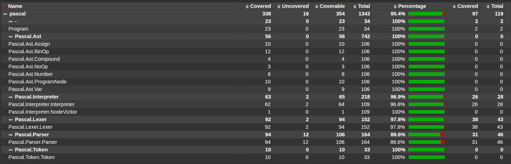

# Интерпретатор Pascal

Интерпретатор подмножества языка программирования **Pascal**, написанный на C# (.NET).

Проект реализует лексический анализ (lexer), синтаксический анализ (parser), построение абстрактного синтаксического дерева (AST) и его последующее исполнение.

## Требования

Для работы с проектом вам понадобятся:

*   [.NET SDK](https://dotnet.microsoft.com/download) (версии 6.0 или выше, рекомендуется .NET 9.0)
*   Инструмент для генерации отчетов о покрытии (для запуска тестов с отчетом):
    ```bash
    dotnet tool install -g dotnet-reportgenerator-globaltool
    ```

## Установка и сборка

1.  **Клонирование репозитория:**
    ```bash
    git clone https://github.com/AItEKS/Kuznetsov_tppl.git
    cd Kuznetsov_tppl/pascal
    ```

2.  **Восстановление зависимостей и сборка:**
    ```bash
    dotnet restore
    dotnet build
    ```

## Использование

Для запуска интерпретатора используйте команду `dotnet run` из корневой папки проекта.

```bash
dotnet run
```

На данный момент программа запускает встроенный пример кода и выводит в консоль результаты его выполнения: построенное AST-дерево и итоговое состояние таблицы символов (переменных).

## Тестирование и покрытие кода (Code Coverage)

Проект использует библиотеку **xUnit** для модульного (Unit) и интеграционного тестирования, а также **Moq** для создания заглушек (mocks).

### Запуск тестов с генерацией отчета



Для запуска всех тестов, сбора метрик покрытия кода и генерации HTML-отчета используйте следующую команду (для Linux/macOS):

```bash
dotnet test --collect:"XPlat Code Coverage" && reportgenerator -reports:"**/*/coverage.cobertura.xml" -targetdir:"coveragereport" -reporttypes:Html && xdg-open coveragereport/index.html
```

**Что делает эта команда:**
1.  `dotnet test --collect:"XPlat Code Coverage"` — запускает тесты и собирает данные о покрытии в формате XML.
2.  `reportgenerator ...` — преобразует XML-отчеты в удобный HTML-сайт в папке `coveragereport`.
3.  `xdg-open ...` — автоматически открывает отчет в браузере по умолчанию (на Linux).

> **Примечание для Windows:**
> Вместо `xdg-open coveragereport/index.html` используйте `start coveragereport/index.html` или просто откройте файл `coveragereport/index.html` вручную в проводнике.

### Структура проекта

*   **Pascal** (название вашего основного проекта) — Основное консольное приложение и логика интерпретатора.
    *   `Token` — Определение токенов.
    *   `Lexer` — Лексический анализатор, преобразующий текст в токены.
    *   `Ast` — Узлы абстрактного синтаксического дерева (AST).
    *   `Parser` — Синтаксический анализатор, строящий AST из токенов.
    *   `Interpreter` — Модуль, исполняющий AST.
*   **Pascal.Tests** — Проект с модульными и интеграционными тестами.

## Используемые библиотеки

*   [xUnit](https://xunit.net/) — Фреймворк для тестирования.
*   [Moq](https://github.com/moq/moq4) — Библиотека для Mock-объектов.
*   [coverlet.collector](https://github.com/coverlet-coverage/coverlet) — Сборщик данных о покрытии кода.
*   [ReportGenerator](https://github.com/danielpalme/ReportGenerator) — Генератор отчетов о покрытии.